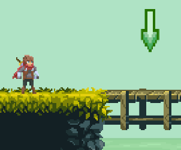
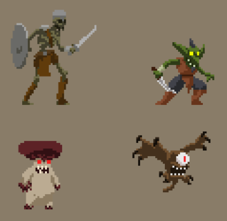

## What's new

- Добавил реализацию `RayCast` коллизий (описание будет ниже)
- Добавился [2ой уровень](https://bakudas.itch.io/generic-dungeon-pack) `./assets/levels/level02` и для того чтобы на него перейти,  
  нужно собрать все монетки и встать в позицию под зеленой стрелкой (в конце карты) 
  
- Добавил [тайлы](https://luizmelo.itch.io/monsters-creatures-fantasy) для 4х противников 
  
- Добавил базовый набор движений + возможность задавать противников на карте уровня