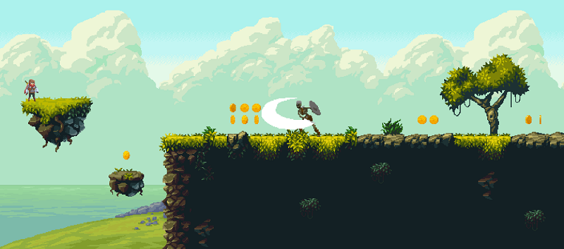
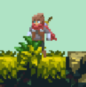
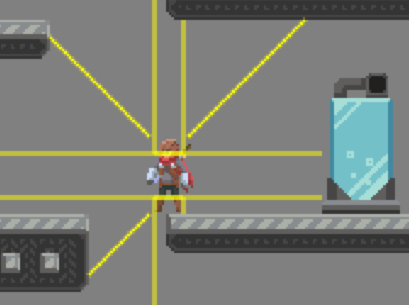

# The Last Ninja Game


## Start
```shell
npm install
npm run start
```

Короче. Это попытка разобраться с игровыми механиками, такими как:
- Коллизии
- Анимация персонажей
- Построение уровней
- Камера, которая следит за игроком
- Параллаксом
- ИИ врагов
- и т.д.

### Enemies
- Skeleton
- Flying Eye
- Goblin
- Mushroom

Здесь `./src/assets/enemies`, лежат тайлы.
Здесь `./src/assets/maps/animation-maps`, лежат мапы анимации:
- `attack` - атака
- `idle` - ожидание
- `move` - движение
- `dead` - смерть персонажа
- `block` - блок (только для `skeleton`)
- `take-hit` - урон

### Tiled Map Editor
#### Уровни
Немного, как организовано хранение уровня и всех его свойства.

- `level 01` - `./assets/maps/level-maps/level01.json`
- `level 02` - `./assets/maps/level-maps/level02.json`

Оказалось, что все параметры уровня удобно моделировать и хранить в `tmx` формате, с дальнейшей выгрузкой в `JSON` формат:
- карта уровня
- слои карты уровня (например, когда мы хотим поместить объекты, которые будут перед игроком)<br/>

- противники
- размер экрана
- размер `camera trap`
- позиция игрока
- позиции монеток (объектов)
- точка перехода на следующий уровень
- расположение коллизий

##### Описание слоев
- `before-layer` - слой, который будет наложен поверх всех
- `collisions` - слой, где располагаются координаты коллизий и их тип
- `respawn` - слой, где указаны координаты точек респауна (пока как задумка, чтобы не возвращаться при выходе за пределы карты на начальную точку)
- `level` - слой, где задаются некоторые свойства, такие как:
1. `screen` - размер экрана (собственно размер канвы), при построении уровня будут учитываться XY объекта для задания исходной точки 
2. `camera-trap` - исходное положение камеры, где позиция объекта строиться от нулевой точки XY уровня
3. `player` - координаты исходной точки игрока
4. `next-level-gate` - координаты "ворот" следующего уровня (когда будет коллизия с игроком, то грузим следующий уровень)
5. `next-level-arrow` - метка, где находится "ворота" следующего уровня (видима, только когда будут выполнены все условия, сейчас это - собрать все монетки)
6. `prev-level-gate` - координаты "ворот" предыдущего уровня (пока не реализовано и надо думать, есть ли смысл)
- `enemies` - слой, где располагаются координаты противников с их типами:
1. `skeleton`
2. `flyingEye`
3. `goblin`
4. `mushroom`
- `coins` - слой, где указываются координаты монеток (скорее всего, это будет задел на будущее, где можно будет помещать x,y объекта и его тип, т.к. помимо монеток могут быть другие объекты)

##### Описание дополнительных свойств
- `tilewidth` - базовая ширина спрайта в пикселях
- `tileheight` - базовая высота спрайта в пикселях
- `width` - ширина всего уровня в кол-ве спрайтов
- `height` - высота уровня в кол-ве спрайтов

#### Анимация персонажей
Таким же образом удобно хранить анимацию персонажей, где слой, его имя, означает то или иное действие.
А с учетом, что высота карты это один спрайт (берется из тайла персонажа), то на выходе получаем JSON
со слоями и массивом индексов из набора.

- `player` (основные движения) - `./assets/maps/animation-maps/ninja.json`
- `player` (бег с мечом) - `./assets/animation-maps/maps/ninja-sword.json`
- `player` (атака из лука) - `./assets/animation-maps/maps/ninja-bow.json`
- `flying eye` - `./assets/animation-maps/maps/flying-eye.json`
- `goblin` - `./assets/animation-maps/maps/goblin.json`
- `mushroom` - `./assets/animation-maps/maps/mushroom.json`
- `skeleton` - `./assets/animation-maps/maps/skeleton.json`

Например, для игрока определены следующие слои:
- `idle` - ожидание
- `crouch` - приседание
- `slide` - скольжение
- `flip` - переворот в верхней точке прыжка
- `move` - движение
- `jump` - прыжок
- и т.д.

## Tips&Tricks
Здесь описаны "механики", с которыми удалось как-то разобраться.
- [Статья](https://www.gamasutra.com/blogs/YoannPignole/20131010/202080/The_hobbyist_coder_1_2D_platformer_controller.php?print=1),
где можно почитать реализацию коллизий через `ray`, думаю, надо переходить на неё, т.к. текущая реализация удобна, когда
это ограниченное пространство (нет лагов, когда ускорение по Y добавляет следующе движение за индекс) и все объекты
строго одного размера.

### Как работают коллизии
За основу взял `RayCast` коллизии из [статьи](https://www.gamasutra.com/blogs/YoannPignole/20131010/202080/The_hobbyist_coder_1_2D_platformer_controller.php?print=1)
Вся логика, определяющая куда "выталкивать" объект в зависимости от типа.



В 2-х словах:
- из объекта строим лучи, горизонтальные и вертикальные;
- ищем все коллизии с объектами (сейчас только прямоугольники);
- фильтруем только самые ближайшие;
- при движении проверяем, что если следующее положение объекта дальше конца луча, то возвращаем его позицию на место.
 
Таким образом, в реальном времени, не зависимо от положения и размера объекта и положения прямоугольников, вытесняем объект из хитбоксов.

#### Особенности
- По `Y` оси добавлен буфер в `100px`, чтобы игрок мог "упасть" или прыгнуть выше размера лимита уровня
- Текущая реализация умеет только работать с прямоугольниками
- Если ни один луч не пересекается с хитбоксом объекта, то коллизия не сработает (поэтому нужно или строить больше лучей или не делать такие кейсы при дизайне уровней)

#### Bugs
- Можно создать условие, когда угловая скорость по X и Y осям такая, что "проталкивает" игрока внутрь коллизии в левой-верхней или правом-верхнем углу.
 Проблема описана в статье и также решена добавлением `buffer` в начальной точке луча (значения буфера подобраны опытным путем).

### Как работает анимация персонажа и их связь к тому или иному действию (например, атака)
Сейчас организовано следующим образом:
- Класс `src/controller.js` слушает ввод с клавиатуры и перенаправляет на персонажа
- Класс `src/world/interpreters/ninja-interpreter.js` интерпретирует состояние персонажа в действие
- Класс `src/world/animation/ninja-animation/index.js` по флагам, который возвращает интерпретатор,
подставляет ту или иную анимацию и запускает выполнения действия, когда она полностью выполняется

Анимация - это последовательная подстановка следующего кадра, в зависимости какая задержка была выставлена.
Здесь `src/graphic/animator.js` находится реализация, которая от типа анимации `pause` или `loop`, каждый заданный
кадр вычисляем следующий слайд и вызываем колбэк, когда она закончилась.

Сама графика хранится в виде `tileset` - это `.png` где на сетке расположена раскадровка того или иного объекта.
Например, в файле `src/assets/player/ninja-bow-tiles.png` представлена раскадровка атаки из лука (на земле и в воздухе).

Загружая ресурс через класс `src/graphic/sprite-sheet.js`, куда передаем размеры картинки, размеры спрайта,
мы получаем массив кадров по их индексу.
Например, так мы получим кадры для анимации стрельбы из лука на земле:
```javascript
const BOW_TILES = {
  name: 'ninja-bow-tiles', // уникальное имя ресурса, которое грузится классом src/loaders/image-loader.js
  width: 200, // ширина картинки
  height: 148, // высота картинки
  spriteWidth: 50, // ширина спрайта (кадра)
  spriteHeight: 37 // высота спрайта (кадра)
}
// Получаем объект, где хранится массив кадров с их координатами на тайле.
const bowAttackFrames = new SpriteSheet(BOW_TILES).getAnimationFrames(1, 2, 3, 4, 5, 6, 7, 8, 9)
// Далее, помещаем его в объект анимации, где у нас, в зависимости от типа, вычисляется следующий кадр
const bowAttackAnimation = new Animator(bowAttackFrames, 3, AnimatorMode.pause)
// Обновляем следуюий кадр анимации
bowAttackAnimation.animate((done, key) => {
  // колбэк, когда анимация закончилась или её прервали
  done && player.bowAttack() // условно
})

// Отрисовка текущего кадр
new Display().drawSprite(bowAttackAnimation.animation)
```

Координаты вычисляются в зависимости от индекса картинки.
Например, если мы указали индекс 3, то для размеров из примера это будет так:
```javascript
const index = 3
const x = (-- index * spriteWidth) % width
const y = Math.trunc((-- index * spriteWidth) / width) * spriteHeight
```

https://developer.mozilla.org/ru/docs/Web/API/CanvasRenderingContext2D/drawImage

Для отрисовки кадра, используется метод `canvas.drawImage`, где указываем тайл, где расположен
наш кадр, его координаты на нем и координаты, куда поместить "вырезанный кусок" на канву.

### Принцип работы общей камеры игры
Тут можно посмотреть какие типы камер бывают:
- https://www.youtube.com/watch?v=l9G6MNhfV7M
- https://www.youtube.com/watch?v=pdvCO97jOQk

Я выбрал тип `camera trap`, т.к. для платформеров она более оптимальна.

В двух словах: задается размер экрана, общий размер уровня и позиция "рамки", выходя за границы оной, игрок
"двигает" камеру, т.е. задает `x` и `y` координаты.
И при выводе всех картинок, мы корректируем их позиции относительно неё.

## TODO
- Разобраться как хранить анимацию и карту уровня со списком коллизий
      
  1. https://www.youtube.com/watch?v=r6F7WafrvTE&t - создание графики
  2. https://www.youtube.com/watch?v=PmZ38JHEAys&t - тайловая карта

- Разобраться как можно считать коллизии, если хит-бокс объекта больше базового размера спрайта;
- Заливка фона "куском" картинки, например залить все небо из `./assets/levels/level01/sky.png`;
- Анимация и ИИ врагов;
- Коллизии ударов, стрел и файеров с препятствиями и врагами;
- Анимация при уроне персонажа;
- Сбор предметов;
- Ограничение по кол-ву стрел и маны;
- Добавить возможность блока от ударов врагов. 

## Links
1. https://m.habr.com/ru/company/pixonic/blog/428892/ - гайд по созданию игрового ИИ
2. https://rvros.itch.io/animated-pixel-hero - тайлы персонажа
3. https://thorbjorn.itch.io/tiled - приложение, где можно загружать тайловые карты и формировать JSON
4. https://ansimuz.itch.io/magic-cliffs-environment - уровень 01
5. https://edermunizz.itch.io/free-pixel-art-forest - уровень 02 (подуровень)
6. https://oco.itch.io/ - еще какие-то тайлы
7. https://www.spriters-resource.com/ - бесплатные спрайты
8. https://itch.io/game-assets/free - еще бесплатные тайлы
9. https://vectorjs.org/ - библиотека Vector
10. https://suvitruf.ru/2019/03/13/4305/a-brief-introduction-to-lerp/ - линейная интерполяция LERP
11. http://www.jeffreythompson.org/collision-detection/ - много кода по коллизиям